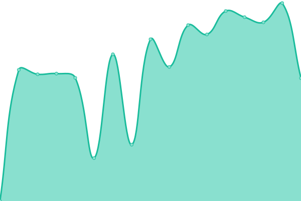

# [📈 Live Status](https://tensoract.github.io/status): <!--live status--> **🟩 All systems operational**

This repository contains the open-source uptime monitor and status page for [Tensoract - Lab](https://tensoract.github.io/status), powered by [Upptime](https://github.com/upptime/upptime).

<!--start: status pages-->
<!-- This summary is generated by Upptime (https://github.com/upptime/upptime) -->
<!-- Do not edit this manually, your changes will be overwritten -->
<!-- prettier-ignore -->
| URL | Status | History | Response Time | Uptime |
| --- | ------ | ------- | ------------- | ------ |
|  [Google](https://www.google.com) | 🟩 Up | [google.yml](https://github.com/tensoract/status/commits/HEAD/history/google.yml) | 

 82ms
     
 | 

<a href="https://tensoract.github.io/status/history/google">100.00%</a>
    

|  [Student UIT](https://student.uit.edu.vn/) | 🟩 Up | [student-uit.yml](https://github.com/tensoract/status/commits/HEAD/history/student-uit.yml) | 

 4054ms
     
 | 

<a href="https://tensoract.github.io/status/history/student-uit">98.90%</a>
    

<!--end: status pages-->

[**Visit our status website →**](https://tensoract.github.io/status)

## 📄 License

- Powered by: [Upptime](https://github.com/upptime/upptime)
- Code: [MIT](./LICENSE) © [Tensoract - Lab](https://tensoract.github.io/status)
- Data in the `./history` directory: [Open Database License](https://opendatacommons.org/licenses/odbl/1-0/)
